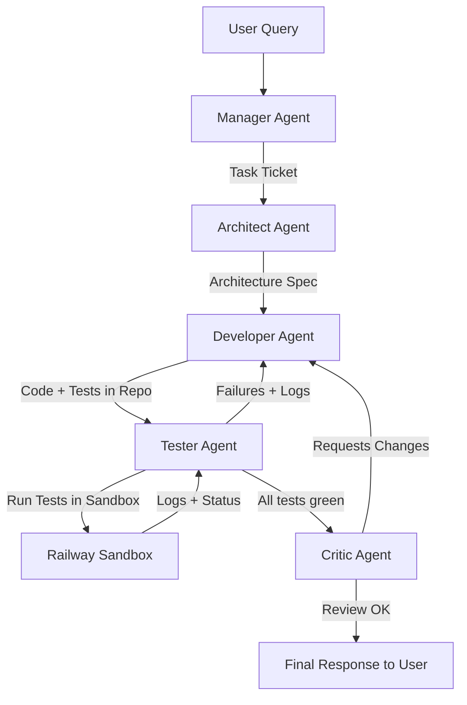

# Architecture and Setup Plan for a Software‑Team‑in‑a‑Box SaaS Assistant (LiteLLM + Agno + Airweave + Railway)

## Executive Summary

This report specifies the architecture, technical requirements, software dependencies, manual setup tasks, and execution plan for building a "software-team-in-a-box" SaaS assistant using LiteLLM, Agno, Airweave, and Railway as the primary infrastructure.

The assistant is designed to simulate a full software engineering team (Manager, Architect, Developer, Tester, Critic) with an Evaluator–Optimizer (test-driven) loop, retrieval over existing code and docs, and sandboxed code execution. Cost and token efficiency are handled by LiteLLM routing across local Ollama models and cloud LLMs, while Airweave provides scalable retrieval across many external systems.[^1][^2]

***

## High-Level Goals

- Provide a "software-team-in-a-box" that can plan, design, implement, test, and review code changes for SaaS applications.
- Prioritize **code quality and architectural correctness** over raw execution speed.
- Use **local models (Ollama)** wherever possible to minimize runtime cost, with cloud models only where strictly necessary for reasoning quality.[^1]
- Use **test-driven development loops** with sandboxed execution so code is validated by real tests, not only by model reasoning.[^3][^4]
- Keep the system self-hostable and portable across Railway and standard Kubernetes.

***

## High-Level Architecture Overview

### Component List

Major components:

- **Frontend / API Layer**: FastAPI service exposing endpoints like `/ask` (main assistant entrypoint) and `/status/{task_id}`.
- **Orchestration & Agents**: Agno agents and Teams modeling Manager, Architect, Developer, Tester, and Critic.[^5]
- **LLM Gateway**: LiteLLM proxy routing requests to local Ollama models and cloud LLMs with fallbacks, budgets, and logging.[^2][^1]
- **Local LLMs**: Ollama-based models for intent routing, worker agents, and some reasoning, running either locally or on Railway.
- **Retrieval Layer**: Airweave, providing unified retrieval across connected systems (e.g., GitHub, Notion, Slack, Confluence) via a vector index and metadata store.
- **Memory Layer**: Mem0 for long-term preferences and Redis/PostgreSQL for short- and long-term conversational and task state.
- **Sandbox Execution Layer**: Railway Sandbox/ComputeSDK, used to run and test generated code in isolated environments.[^6]
- **Observability**: Langfuse for tracing LLM calls and token usage.

### Overall Architecture Diagram

```mermaid
flowchart LR
    subgraph User
      FE[Web UI / Client]
    end

    subgraph Backend[FastAPI Backend]
      API[/REST & WebSocket API/]
      TEAM[Agno Team (Manager, Architect, Developer, Tester, Critic)]
    end

    subgraph Gateway[LiteLLM Proxy]
      LLMGW[LiteLLM Router]
    end

    subgraph LLMs[LLM Providers]
      OLL[Ollama (Local & Cloud Tunnel)]
      OR[OpenRouter (Gemini, Kimi, Qwen, Minimax)]
      ZAI[Z.ai GLM-4.7 (Coding)]
    end

    subgraph Retrieval[Airweave]
      AWAPI[Airweave API]
      AWDB[(Vespa + Postgres)]
    end

    subgraph Memory
      MEM0[Mem0 (Preferences)]
      REDIS[(Redis - short-term)]
      PG[(PostgreSQL - long-term)]
    end

    subgraph Sandbox[Railway Sandbox]
      EXEC[Executor Service]
      CONTS[(Ephemeral Containers)]
    end

    subgraph Obs[Observability]
      LF[Langfuse]
    end

    FE --> API
    API --> TEAM

    TEAM -->|LLM calls| LLMGW
    LLMGW --> OLL
    LLMGW --> OR
    LLMGW --> ZAI

    TEAM -->|Context queries| AWAPI
    AWAPI --> AWDB

    TEAM --> MEM0
    TEAM --> REDIS
    TEAM --> PG

    TEAM -->|Run tests| EXEC
    EXEC --> CONTS

    LLMGW --> LF
```

This diagram shows the FastAPI backend coordinating an Agno multi-agent team, which uses LiteLLM to access different models, Airweave for retrieval, Mem0/Redis/Postgres for memory, and Railway Sandbox for code execution.

***

## Detailed Component Descriptions

### LiteLLM Gateway

LiteLLM is a Python SDK and proxy server that offers an OpenAI-compatible API to route calls to more than 100 LLM providers, including OpenRouter, Z.ai, and Ollama.[^7]

In this architecture it:

- Exposes a single endpoint (e.g., `http://localhost:4000/chat/completions`).
- Maps **virtual model names** (e.g., `intent-model`, `worker-model`, `architect-model`, `developer-model`, `architect-model`, `critic-model`) to real models defined in `gateway/litellm_config.yaml`:
  - `intent-model` → OpenRouter Gemini 2.5 Flash, with ministral and Ollama fallbacks.
  - `worker-model` → OpenRouter Ministral 8B, with Ollama ministral fallback.
  - `developer-model` → Z.ai `glm-4.7` coding endpoint, with OpenRouter Qwen 2.5 Coder and Ollama coder fallbacks.
  - `architect-model` → OpenRouter Kimi K2, with Qwen Plus and Ollama Qwen fallbacks.
  - `critic-model` → OpenRouter Gemini 2.5 Flash, with Minimax and Ollama fallbacks.[^7][^8][^9]
- Enforces **token budgets and rate limits** via LiteLLM’s routing and retry config.
- Implements **fallback chains** so that if a provider is rate limited or out of quota (e.g., Z.ai Lite coding plan), calls are automatically routed to the next best model.
- Streams telemetry to Langfuse for observability.[^10]

### Current Model Assignments

| Agent Role | Virtual Model ID   | Primary Provider/Model                            | Fallbacks                                         |
|-----------|--------------------|---------------------------------------------------|---------------------------------------------------|
| Manager   | `intent-model`     | OpenRouter `google/gemini-2.5-flash`              | Ollama `gemini-3-flash-preview:cloud`, Ministral 3B |
| Worker    | `worker-model`     | OpenRouter `mistralai/ministral-8b-2512`          | Ollama `ministral-3:8b-cloud`                     |
| Developer | `developer-model`  | Z.ai `glm-4.7` (coding endpoint)                  | OpenRouter `qwen-2.5-coder-32b`, Ollama coder     |
| Architect | `architect-model`  | OpenRouter `moonshotai/kimi-k2`                   | OpenRouter `qwen-plus`, Ollama `qwen3.5:397b-cloud` |
| Critic    | `critic-model`     | OpenRouter `google/gemini-2.5-flash`              | OpenRouter `minimax-m2.5`, Ollama `qwen3.5:397b-cloud` |


This decouples model choice from agent logic: Agno agents only reference virtual model IDs.

### Agno (Agents and Orchestration)

Agno is a Python-native agent framework designed for building multi-agent systems with explicit model abstraction, tools, and observability integration.[^5]

Within this project, Agno provides:

- Simple configuration of agents whose `model` points to LiteLLM via an `id` string (e.g., `LiteLLM(id="worker-model")`).[^2]
- A `Team` abstraction for orchestrating multiple agents in a coordinated workflow.
- Support for structured outputs via Pydantic-style response models.

Each role in the software team (Manager, Architect, Developer, Tester, Critic) is represented as an Agno agent with role-specific tools and models.

### Airweave Retrieval Layer

Airweave is an open-source context retrieval layer for AI agents that connects to applications, tools, and databases, syncs their data, and exposes it via unified search.

It provides:

- Connectors for 50+ SaaS apps (Notion, Slack, GitHub, Google Drive, Jira, Salesforce, etc.).
- Continuous syncing and indexing into Vespa (vectors) and PostgreSQL (metadata).
- Search APIs and SDKs (Python/TypeScript) that return relevant documents and structured content.

In this architecture, Airweave is used to:

- Provide **project-level context** for the Manager and Architect agents.
- Retrieve **existing code and documentation** for the Developer and Architect.
- Return **summarized bullet-point context** to reduce token usage.

### Railway Sandbox / Compute Layer

Railway provides a hosted platform where applications and sandboxed services can be deployed quickly, including specific templates for code-execution sandboxes.[^11][^6]

Among other capabilities, Railway supports:

- Running containerized workloads with resource limits and automatic restarts.
- Using its Sandbox and ComputeSDK to execute short-lived code tasks initiated via HTTP.

Within this design, Railway is used to:

- Host the FastAPI backend, LiteLLM proxy, and auxiliary services.
- Host an **executor service** that the Tester agent calls to:
  - Spin up ephemeral containers.
  - Clone the relevant Git branch.
  - Install dependencies.
  - Execute unit/integration tests.
  - Return logs and exit codes.

This serves the same function as E2B/Daytona-style sandboxes using infrastructure the developer already pays for.[^12][^6][^3]

### Memory Layer (Mem0 + Redis + Postgres)

Memory is split into three layers:

- **Mem0**: Long-term preference and profile memory, storing facts like "this user prefers FastAPI" or "always use Tailwind CSS for UI".[^13]
- **Redis**: Short-term conversational memory, used for compressed summaries of recent interactions (e.g., last 5 turns per user) to keep prompt tokens small.
- **PostgreSQL**: Structured state storage for tasks, sub-tasks, test results, branch names, and metadata needed across long-running workflows.

This split ensures the LLM context remains compact while durable state is stored in a traditional database.

### Observability: Langfuse

Langfuse is used as the central observability hub for LLM calls and agent workflows. It integrates directly with LiteLLM as a callback provider.[^10]

It tracks:

- Per-model and per-agent token usage.
- Error rates and latencies.
- Traces across multi-agent workflows (e.g., from Manager through Tester).

This data is crucial for cost control and debugging complex agent interactions.

***

## Agent Roles and Workflows

### Roles and Responsibilities

- **Manager (Intent Router)**
  - Model: small local model via Ollama (e.g., Llama 3.2 3B).
  - Responsibilities:
    - Classify incoming user requests into intent categories.
    - Fetch user preferences from Mem0.
    - Fetch high-level project context from Airweave.
    - Produce a normalized task ticket.

- **Architect (Requirements Engineer / Planner)**
  - Model: premium reasoning model (e.g., Claude 3.5 Sonnet or equivalent).
  - Responsibilities:
    - Turn the task ticket + context into a detailed technical specification.
    - Express the spec as a strict Pydantic-like schema (files, modules, APIs, DB schema, test plan).

- **Developer (Executor)**
  - Model: code-optimized model (e.g., Qwen 2.5 Coder via Ollama or frontier coding models).
  - Responsibilities:
    - Use MCP / Git tools to read current repo state.
    - Implement code and tests for one sub-task at a time.
    - Commit to feature branches or prepare patches.

- **Tester (Evaluator–Optimizer Loop)**
  - Model: lightweight reasoning model, as most work is done by tests.
  - Responsibilities:
    - Instruct Railway Sandbox to build and test the generated code.
    - Parse and summarize logs and errors.
    - Decide whether to send errors back to Developer for fixes.

- **Critic (Code Reviewer)**
  - Model: strong reasoning model.
  - Responsibilities:
    - Perform static review on style, architecture, and maintainability.
    - Provide improvement suggestions even if tests pass.

### Evaluator–Optimizer Workflow Diagram



Key properties:

- The **Developer–Tester** loop can iterate many times until tests pass, because execution speed is not the primary concern.
- The Critic performs an additional, non-functional quality check even after tests are green.

### Data and State Flow

1. User request enters via FastAPI.
2. Manager reads:
   - Mem0 for preferences.
   - Airweave for context.
3. Architect generates a structured spec, stored in PostgreSQL.
4. Developer updates code in Git (MCP or direct Git API).
5. Tester triggers Sandbox runs and stores results.
6. Loop continues until success; final state is saved and user is notified.

***

## Technical Requirements

### Hardware Requirements

For development (single-machine):

- **CPU**: 8 cores / 16 threads (e.g., Ryzen 7 7735HS) — sufficient for local dev, multiple Docker containers, and some local LLM inference.
- **RAM**: 32 GB — supports running FastAPI, LiteLLM, Ollama, Redis, Postgres, and tests concurrently.
- **GPU**: NVIDIA RTX 3050 Mobile + integrated Radeon 680M — adequate for small/medium Ollama models; large 70B models should be remote.
- **Storage**: ~1 TB NVMe across two drives, enough for Docker images, source control, and vector indexes.

For production (on Railway):

- Service instances sized per component (exact limits can be tuned):
  - FastAPI: 1–2 vCPU / 512 MB–1 GB RAM.
  - LiteLLM proxy: 1 vCPU / 512 MB RAM.
  - Airweave backend: 2 vCPU / 2–4 GB RAM.
  - Vespa (if self-hosted): 2+ vCPU / 4+ GB RAM.
  - Ollama service: 4 vCPU / 8–16 GB RAM depending on model size.
  - Railway-managed Postgres and Redis.

### OS Requirements

- Development:
  - Ubuntu 24.04 LTS (current) or Pop!_OS 24.04.
  - Both support NVIDIA drivers, Docker, and Ollama.

- Production:
  - Railway-managed containers based on Linux images (Ubuntu/Debian variants).

***

## Software Requirements

### System-Level Dependencies

On the development machine:

- Python 3.11+.
- `uv` (optional but recommended for fast virtual envs).
- Docker and docker-compose.
- Git 2.4+.
- Railway CLI (`@railway/cli`).[^11]
- Optionally `kubectl` if Kubernetes is later adopted.

### Python Dependencies (Project-Level)

Core packages:

- `agno` — agent framework and Teams.[^5]
- `litellm` — LLM gateway, routing, and budgets.[^1]
- `airweave-sdk` — retrieval client.
- `fastapi`, `uvicorn` — API server.
- `redis`, `psycopg2-binary`, `pydantic` — memory, DB, schemas.
- `mem0ai` — preference memory.[^13]
- `langfuse` — observability.[^10]
- `python-dotenv`, `httpx` — config and HTTP tools.
- `computesdk` — to call the Railway Sandbox for code execution.[^6]
- `pytest` — for generated test execution and local validation.

### External Services and API Keys

- Railway: `RAILWAY_TOKEN`, `POSTGRES_URL`, `REDIS_URL`.
- OpenRouter: `OPENROUTER_API_KEY` (primary cloud LLM provider for Gemini 2.5 Flash, Ministral, Kimi K2, Qwen Plus, Minimax).
- Z.ai: `ZAI_API_KEY` (GLM‑4.7 coding endpoint for the Developer agent; Lite/Coding plan quota is enforced on Z.ai’s side).
- Airweave: `AIRWEAVE_API_KEY`, collection IDs.
- Langfuse: `LANGFUSE_PUBLIC_KEY`, `LANGFUSE_SECRET_KEY`.[^10]
- Mem0: `MEM0_API_KEY`.[^13]
- GitHub: `GITHUB_PAT` with repo scope.
- (Optional) Google Cloud / Vertex AI: project and credentials if you later choose to call Gemini or Claude directly instead of via OpenRouter.

All secrets should be stored in a `.env` file for local development and configured as environment variables in Railway for production.

***

## Manual Setup Tasks

### Account and Service Provisioning

1. **Railway**
   - Create project for the assistant.
   - Add managed Postgres and Redis instances.
   - Enable or configure a sandbox/compute service for code execution.[^6]

2. **LLM Providers**
   - OpenRouter: create an account at [openrouter.ai](https://openrouter.ai), add credits, and generate an API key.
   - Z.ai: create an account at [z.ai](https://z.ai), obtain a coding-plan API key for GLM-4.7.
   - (Optional) Ollama: install locally or use the cloud tunnel for fallback models.

3. **Airweave**
   - Sign up or deploy Airweave.
   - Create a collection (e.g., `saas-project`).
   - Connect at least two data sources (e.g., GitHub and Notion) through OAuth.

4. **Langfuse**
   - Create project and obtain public/secret keys.[^10]

5. **Mem0**
   - Create workspace, retrieve API key.[^13]

6. **GitHub**
   - Create a repository (e.g., `saas-assistant`).
   - Create a PAT with appropriate scope.

### Environment Configuration

- Create a `.env` file locally with all necessary keys.
- Configure equivalent environment variables in Railway for each service (FastAPI, LiteLLM proxy, executor service, etc.).

### Airweave Configuration

- Use Airweave dashboard to:
  - Confirm connectors are syncing.
  - Test a search query.
  - Note the `readable_id` used in SDK calls.

### Sandbox Configuration on Railway

- Decide on a base image and resource limits for sandboxes (e.g., Python image with build tools).
- Deploy an executor service that:
  - Accepts project+branch+command via HTTP.
  - Spins up an ephemeral container.
  - Clones the corresponding Git ref.
  - Installs dependencies and runs tests.
  - Returns logs and status to the Tester agent.

***

## Execution Plan and Phased Implementation

### Phase 0 — Environment and Accounts (Day 0)

Objectives:

- Ensure all non-code prerequisites are in place.

Tasks:

- Install Python, Docker, Git, Railway CLI on the development machine.
- Set up all external accounts and gather API keys.
- Create `.env` locally and configure Railway project and databases.
- Confirm Airweave connectors and collection are operational.

### Phase 1 — LiteLLM Gateway and Local LLMs (Day 1)

Objectives:

- Provide a unified LLM endpoint for all agents.

Tasks:

- Install and configure LiteLLM with virtual model IDs.
- Install and test Ollama locally with minimal models.
- Validate that Agno agents can call `intent-model`, `worker-model`, and `architect-model` via LiteLLM.

### Phase 2 — Retrieval and Memory (Day 2)

Objectives:

- Make project context and user preferences available to agents.

Tasks:

- Implement Airweave client for summarized context.
- Integrate Mem0 for preference storage and retrieval.
- Implement Redis-based short-term memory with periodic compression.

### Phase 3 — Agent Roles and Team (Day 3)

Objectives:

- Implement Manager, Architect, Developer, Tester, and Critic agents.

Tasks:

- Define Pydantic schemas for task tickets, architecture specs, change plans, and test results.
- Implement each agent with role-appropriate tools and models.
- Build an Agno `Team` that orchestrates the multi-agent workflow.

### Phase 4 — Sandbox Integration on Railway (Day 4)

Objectives:

- Run tests on generated code in isolated environments.

Tasks:

- Implement or configure Railway Sandbox executor service.
- Add tools to the Tester agent that call the executor.
- Implement the multi-iteration Developer–Tester loop driven by test outcomes.

### Phase 5 — API Layer and Observability (Day 5)

Objectives:

- Expose a clean API and capture rich telemetry.

Tasks:

- Wrap the workflow in FastAPI endpoints.
- Integrate Langfuse via LiteLLM callbacks.[^1][^10]
- Deploy full stack to Railway and validate with example tasks.

***

## Conclusion

The proposed architecture combines LiteLLM, Agno, Airweave, and Railway Sandbox into a cohesive system that simulates a software engineering team with a strong emphasis on correctness and test-driven development. LiteLLM centralizes multi-model routing and token control, Agno structures role-based agents and workflows, Airweave supplies contextual knowledge from many external systems, and Railway provides a unified platform for hosting services and securely executing generated code.[^2][^6][^1]

This design is well aligned with the given hardware (Ryzen 7, 32 GB RAM, RTX 3050) for development, while delegating heavy production workloads to Railway. It is modular enough to evolve (e.g., replacing specific models or sandboxes) without breaking the overall architecture.

---

## References

1. [LiteLLM - Getting Started | liteLLM](https://docs.litellm.ai) - https://github.com/BerriAI/litellm

2. [LiteLLM - Agno](https://docs.agno.com/models/providers/gateways/litellm/overview) - Integrate LiteLLM with Agno for a unified LLM experience.

3. [E2B AI Sandboxes: Features, Applications & Real-World Impact](https://towardsai.net/p/machine-learning/e2b-ai-sandboxes-features-applications-real-world-impact) - This is where E2B (Execute to Build) comes in — a game-changing platform that lets AI agents and app...

4. [GitHub - ego/e2b: Sandboxed cloud environments for AI agents & apps with a single line of code](https://github.com/ego/e2b) - Sandboxed cloud environments for AI agents & apps with a single line of code - ego/e2b

5. [Quickstart - Agno](https://docs.agno.com/knowledge/quickstart) - Setup. 1. Create virtual environment.

6. [Deploy Sandbox - Railway](https://railway.com/deploy/sandbox) - Seamless Integration - Works as a drop-in provider alongside E2B, Vercel, and Daytona in your existi...

7. [GitHub - BerriAI/litellm: Python SDK, Proxy Server (LLM Gateway) to call 100+ LLM APIs in OpenAI format - [Bedrock, Azure, OpenAI, VertexAI, Cohere, Anthropic, Sagemaker, HuggingFace, Replicate, Groq]](https://github.com/BerriAI/litellm/) - Python SDK, Proxy Server (LLM Gateway) to call 100+ LLM APIs in OpenAI format - [Bedrock, Azure, Ope...

8. [Router - Load Balancing | liteLLM](https://litellm.vercel.app/docs/routing) - LiteLLM manages:

9. [Fallbacks - LiteLLM](https://docs.litellm.ai/docs/proxy/reliability) - If a call fails after num_retries, fallback to another model group. Fallbacks are typically done fro...

10. [LiteLLM](https://docs.agentops.ai/v2/integrations/litellm) - Track and analyze your LiteLLM calls across multiple providers with AgentOps

11. [How to Deploy Voice AI Agents Using Railway: Real Insights & Tips](https://dev.to/callstacktech/how-to-deploy-voice-ai-agents-using-railway-real-insights-tips-1fd2) - How to Deploy Voice AI Agents Using Railway: Real Insights & Tips ...

12. [Daytona - Secure Infrastructure for Running AI-Generated Code](https://www.daytona.io) - Instant Sandboxes.​​ Daytona lets you spin up sandboxes in milliseconds and shut them down just as f...

13. [Pipeline Logic](https://developer.hpe.com/blog/post-9-agentic-ai-with-agno-ollama-and-local-llama3/) - The HPE Developer portal

- [GitHub - BerriAI/litellm](https://github.com/BerriAI/litellm/)
- [Z.ai Coding API Documentation](https://api.z.ai/docs)
- [OpenRouter Model Index](https://openrouter.ai/models)

## Future Extensions

- Integrate Perplexity `pplx-api` via LiteLLM for search-augmented reasoning.
- Add Vertex AI / Antigravity as a direct provider when API quotas and billing are stable.
- Experiment with AirLLM for local 70B+ models on constrained GPUs if offline inference becomes required.
